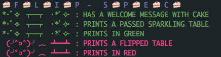

[](https://codeclimate.com/github/NULL-OPERATOR/flip_spec)[](https://travis-ci.org/NULL-OPERATOR/flip_spec)


# rspec table flipper 🍰

because this is all you really need to know



## Installing


add to your gemfile, then bundle

```ruby
gem 'flip_spec'
```
then add to your .rpsec file

```
--format FlipSpec
```


*inspired by https://github.com/iridakos/table_flipper*
